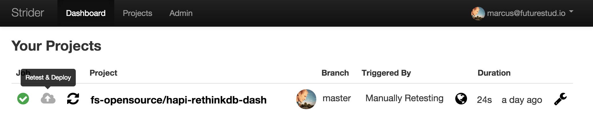

# Strider — Enable Email Notifications

This article illustrates the steps to configure Strider for Email Notifications. First, let's start with an overview of related Strider blogposts.

## Configure Strider Server for Email Notifications

Strider email notifications require a proper server setup with SMTP configuration. You can use services like [Mailgun](http://www.mailgun.com/), [Mandrill](https://mandrill.com/), [Postmark](https://postmarkapp.com/) or whatever you want sending email notifications.

You have to configure the Strider server and pass the SMTP credentials as environment variables to the server process. You can pass the SMTP configuration as parameters for the start command like `SMTP_PORT=587 SMTP_HOST="smtp.mailgun.org ./bin/strider` or set the environment variables using `export SMTP_HOST="my.smtp.server"`.

Required SMTP parameters are `SMTP_HOST`, `SMTP_USER` and `SMTP_PASS`. `SMTP_PORT` is set to 587 by default. `SMTP_FROM` has `noreply@stridercd.com` as standard address.

- **`SMTP_HOST`**: SMTP server hostname (e.g smtp.mailgun.org)
- `SMTP_PORT`: SMTP server port (default: 587)
- **`SMTP_USER`**: SMTP server auth username
- **`SMTP_PASS`**: SMTP server auth password
- `SMTP_FROM`: emails from address (default: Strider noreply@stridercd.com)

(Re)start your Strider server with SMTP configuration and proceed the following steps to activate email notifications for your builds.

## Add Strider Email Notifications to Your Project

The Strider platform is build around a powerful [extension loader](https://github.com/Strider-CD/strider-extension-loader). The Strider ecosystem provides many extensions for different services. Extensions are called: plugins.

We use the [strider-email-notifier](https://github.com/Strider-CD/strider-email-notifier) plugin to enable email notifications for successful or failed builds.

First, you need to install the **Email Notifier** plugin in the Strider admin panel. Head over to `Admin -> Plugins` and hit the install button if not already installed.

Afterwards, go to the project settings of the project you want to have email notifications enabled.

The Email Notifier plugin is now available in the Available Plugins box. Drag and drop the Email Notifier plugin from **Available Plugins** to **Active Plugins**.

That's it. You've activated email notifications for your project.

## Test Notifications

By default, notifications are only send if the build status changes. In case your last build succeeded and you're building again, there won't be any notification. Change the plugin configuration to inform you on every build about the result.

This way, you can verify successful email notification configuration. If everything is fine, just uncheck the setting to send emails for every build.

Relax and test your code! Now you'll know if something broke.
