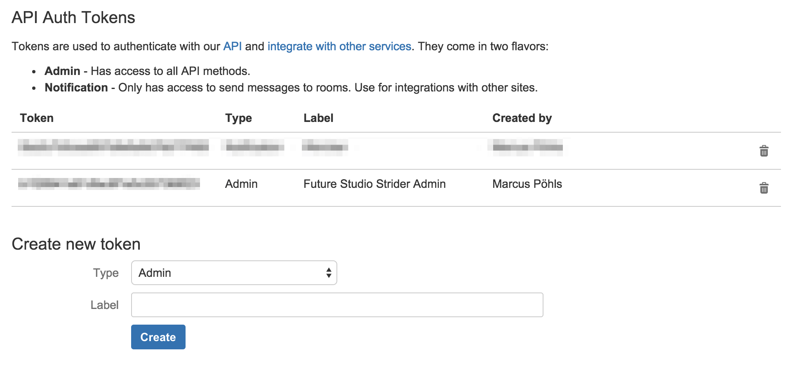
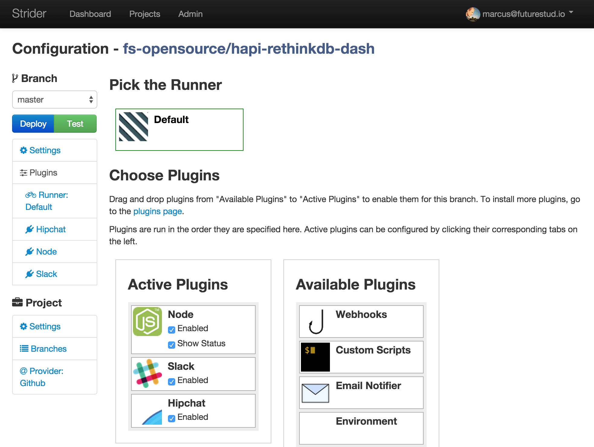
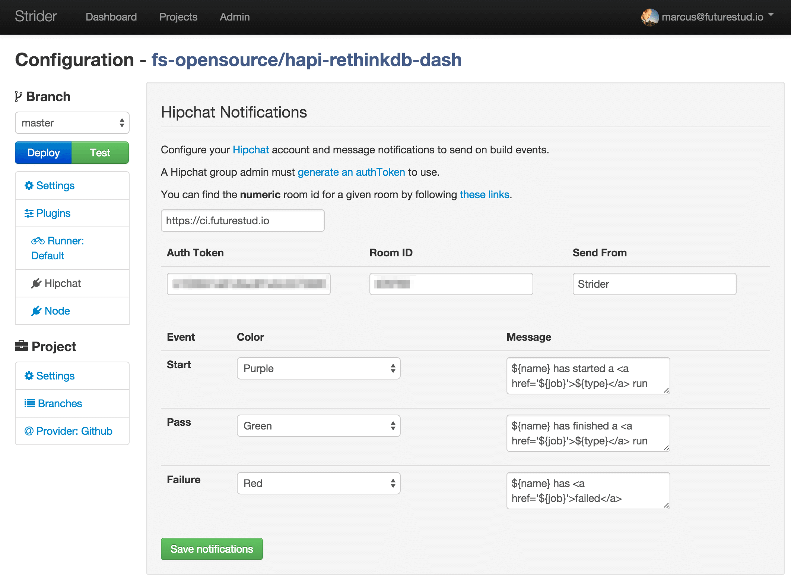
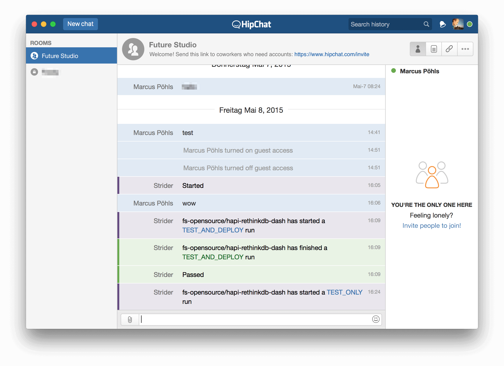

# Strider — Integrate and Notify with HipChat

HipChat is used by many development teams due to its integration with other Atlassian products. If you still want to use Strider to run your builds and deployments, you can notify rooms about the statuses.

## Install Strider-HipChat Plugin

The Strider ecosystem provides plugins to integrate with many services and also for HipChat. Sending notifications about build and deployment statuses requires you to install the [strider-hipchat](https://github.com/jfromaniello/strider-hipchat) plugin first.

This time, we can’t use the Strider plugin admin panel to seamlessly install additional functionality. We have to get our hands dirty right from the beginning and use the command line to add the hipchat plugin to the Strider platform.

First, SSH into your server and change the directory to Strider’s installation folder. Here you can install the plugin like any other NodeJS module.

    cd /path/to/your/strider
    npm install strider-hipchat

We use `npm` (Node Package Manager) to install the plugin. Installation succeeded? Restart your Strider server and it will recognize the newly added plugin.

## Create HipChat Authentication Token

Third-party integrations to hipchat require an authentication token to access a specific hipchat room. Generate a [new HipChat authentication token](https://futurestudio.hipchat.com/admin/api) for Strider.

Select the token type **Admin** and provide a label for identification. Even though we want to send Notifications to HipChat, the plugin requires an Admin token.



**Hint:** Lately, HipChat released a new version of their API (v2). We still use **version 1** to send notifications.

## Configure Notifications for Strider Project

Go back to Strider and navigate to the settings of the project you want to enable HipChat notifications for. Head over to the **Plugins** view. Drag and drop the now available _Hipchat_ plugin from **Available Plugins** to **Active Plugins**. This will add a new link in the left sidebar.



Now click the **Hipchat** link in the left sidebar to open the plugin settings. We need the previously created authentication token and the room id.



First, fill the field for your server url. Afterwards, provide the auth token and room id values. The **Send From** field schon be only a single name! No spaces, no dashes, just a single name. We weren’t be able to send notifications when typing „Future-Studio-Strider“ and any variant without dashes, but spaces etc. So make sure this value is in correct format: just a single word …

Another thing you can specify are the highlight colors for test and deployment starts, successes and failures. You can use the following messages for your notifications. Of course you can adjust them to your needs and preferences.

**Start**

```
${name} has started a <a href="${job}">${type}</a> run
```

**Success**

```
${name} has finished a <a href="${job}">\${type}</a> run
```

**Failure**

```
${name} has <a href="${job}">failed</a>
```

Save. Provided all values? Great! Then let’s go on an test notifications.

## Test HipChat Notifications

The configuration part is done. We can jump right into the testing and manually start a build for the project we configured a second ago. You can use either the **Deploy** or **Test** buttons in the project settings or visit the project overview and start the build from there.


If everything works fine, you should see the notifications for started tests (and deployments) in your HipChat room.



That’s it. If everything is correctly configured you’ll see the notification messages in your HipChat room.

**Hint:** there won’t be any message in the build process that the notification was sent to HipChat.

---

#### Additional Ressources

- [Strider-HipChat-Plugin](https://github.com/jfromaniello/strider-hipchat) on GitHub
- [Strider-HipChat on NPM](https://www.npmjs.com/package/strider-hipchat)
