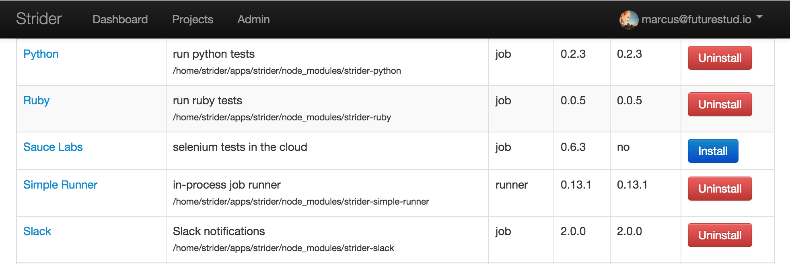
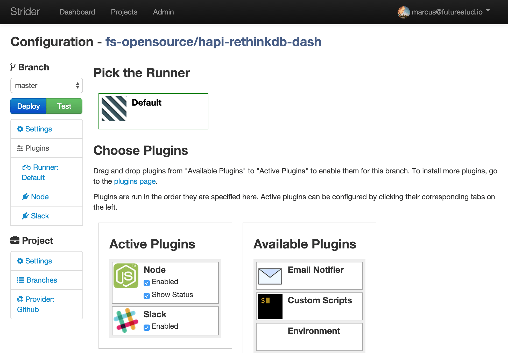
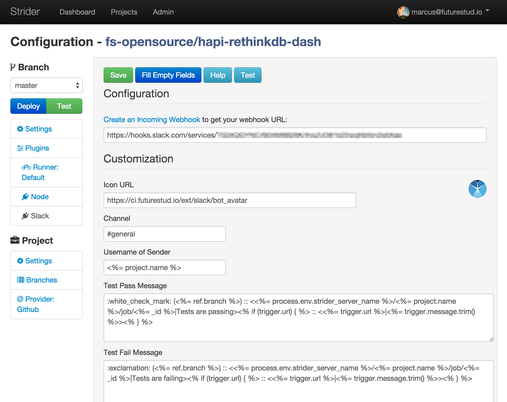
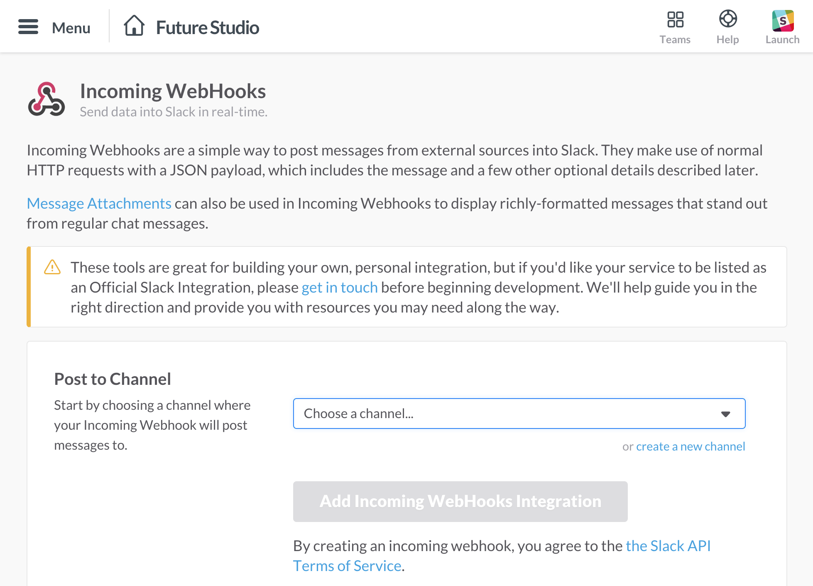
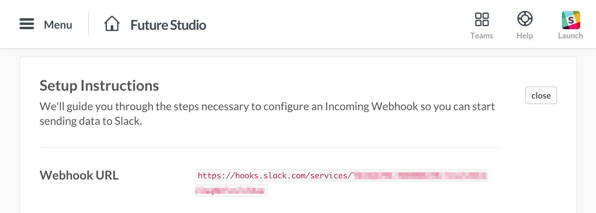
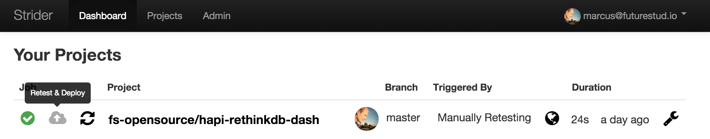
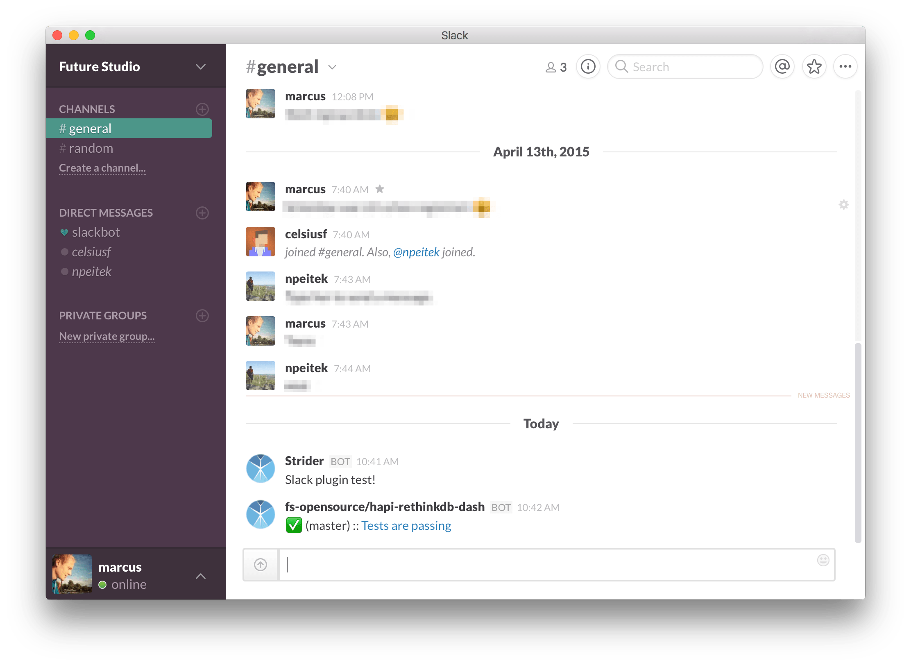

# Strider — Integrate and Notify with Slack

Slack seems to be the team messaging tool of the moment. And also Strider provides a plugin to connect with Slack and send notifications for either successful or failed test runs and deployments.

## Install Strider-Slack Plugin

The Strider ecosystem contains the [strider-slack-plugin](https://github.com/Strider-CD/strider-slack) to integrate both services: Slack and Strider. Visit Strider’s admin plugin overview and install the Slack plugin if not already done.

Search for **Slack** and make sure the plugin is installed. If not, click the **Install** button.

## Create and Configure the Strider-Slack Plugin

Now head over to the project’s settings page you want to automatically send notifications for build and deployment statuses. Click the **Plugins** link in the left sidebar. Drag and drop the Slack plugin from **Available Plugins** into **Active Plugins**.

Moving the **Slack** card into active plugins will add the plugins name as a link in the left sidebar. Click the newly added **Slack** link to show the plugin options.

By default, all fields are empty. Don’t worry, it’s just one click to fill most of the fields. Clicking the button **Fill Empty Fields** will do the job for you. The autgenerated text include the metadata information for your Strider server, the project name and tested/deployed branch. Of course you can customize the message texts to fit your needs.

The only thing missing is a Slack webhook to notify your channel with the defined message. You can follow the [Create an Incoming Webhook](https://my.slack.com/services/new/incoming-webhook) link in the plugin settings. This will redirect you to Slack and let’s you directly create the hook for a selected channel.

Choose your desired channel from the dropdown list or create a new one. Afterwards, click **Add Incoming Webhook Integration** and your hook is ready to use.

You can customize the webhook settings. The important part is the **Webhook URL**. Copy the highlighted link and return to the Strider-Slack settings. Paste the webhook link in the corresponding field and save your settings.

## Test Slack Notifications

Finishing Straight! Configuration is done, now let’s check if everything works like a charm. You can manually trigger an integration run for your project from Strider’s dashboard.

Regardless of whether the project tests are successful or fail, the plugin will notifiy the channel with a corresponding message.

—

#### Additional Ressources

- [Strider-Slack-Plugin](https://github.com/Strider-CD/strider-slack)
- [Slack create incoming webhook](https://my.slack.com/services/new/incoming-webhook)
