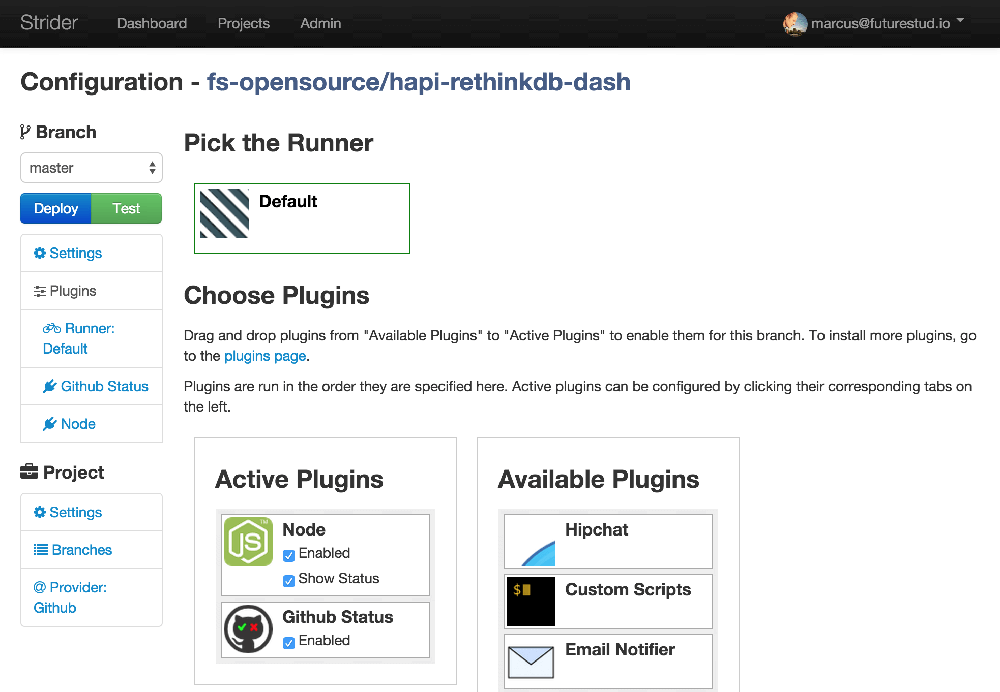
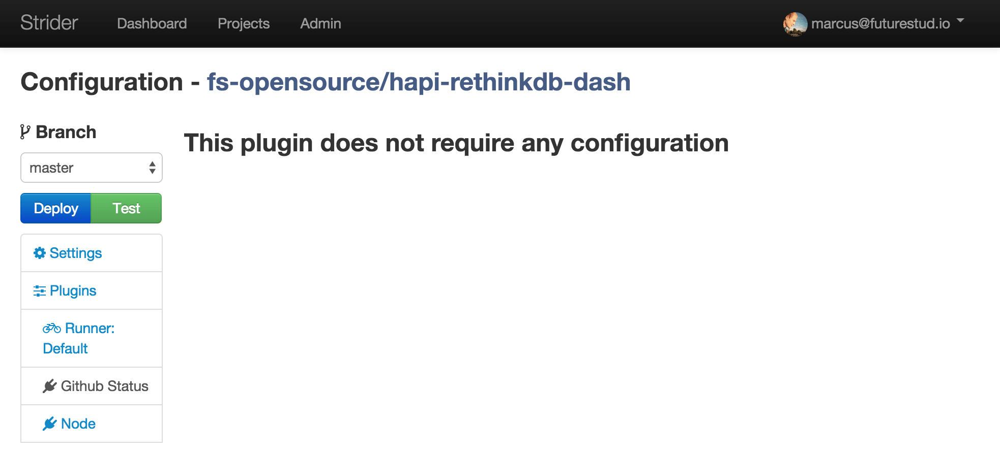
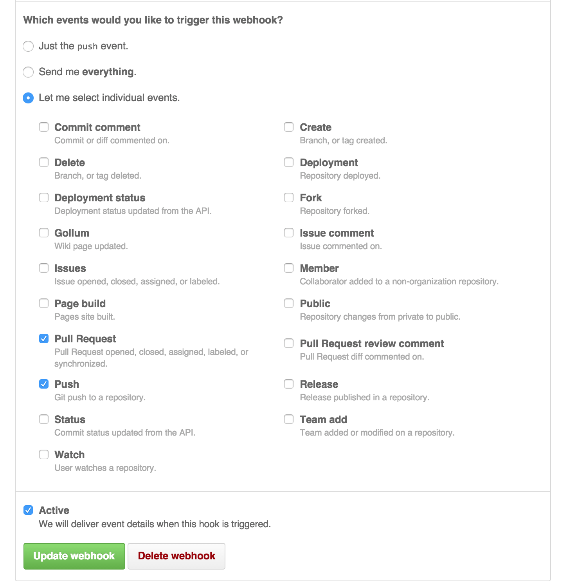
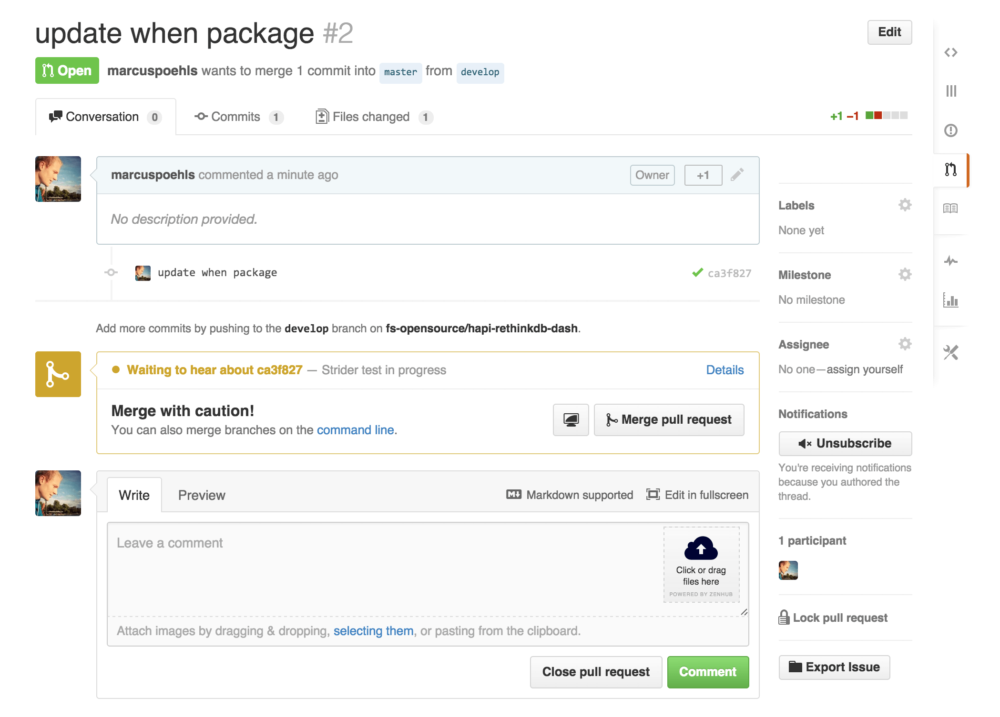
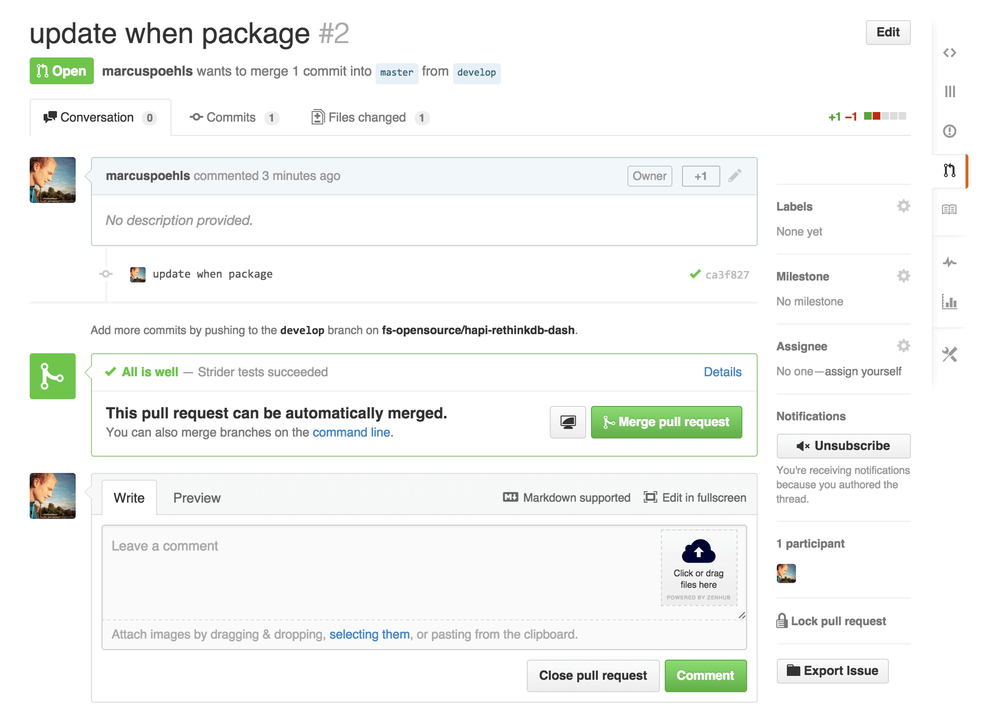

# Strider — Report Build Status to GitHub

GitHub provides a powerful status API indicating if builds succeed or fail. Strider offers the ability to use the status API with the help of a plugin and attach build statuses to pull requests.

## Install Strider-GitHub-Status Plugin

If you read other articles in this series you know that Strider composes of plugins. Of course there is a plugin to report build status to GitHub, too. The [strider-github-status](https://github.com/Strider-CD/strider-github-status) plugin requires the **[strider-github](https://github.com/Strider-CD/strider-github)** plugin to be already installed. In case you don’t have [Strider connected with GitHub]() already, you can follow our guide first and resume later.

Installed strider-github plugin? Awesome, let’s get our hands dirty and install the plugin to send statuses back to commits.

First, SSH into your server and change to Strider’s installation directory. We use `npm` to install the strider-github-status plugin, since it’s not integrated in the Strider ecosystem yet.

    cd /path/to/your/strider
    npm install strider-github-status

Restart your Strider server and it will load the plugin during startup.

## Configure GitHub-Status for Strider Project

Visit the Strider web interface and head over to the plugin settings of your project. Here, you can drag and drop the **GitHub Status** plugin from **Available Plugins** to **Active Plugins**.

That’s it. The plugin is activated and doesn’t need any further configuration. Easy, going!

Activating the GitHub-Status plugin for your project adds a new link in the left sidebar. Click the new **GitHub Status** link and you’ll just see the headline **no configuration required**.

The default web hook configuration on GitHub triggers builds on Strider for your project. Just verify that the checkbox for **Pull Request** is checked. If not, do so and update the GitHub web hook to notify Strider even for pull requests.

## Test GitHub-Status Integration

Testing the GitHub-Status plugin requires you to have a GitHub repository added to Strider.

Make changes to your repository code on a separate branch or fork and push them to GitHub. Now create a pull request with your changes. The configured web hook for your GitHub repository triggers a Strider build. Strider starts the integration process and in parallel changes the build status on GitHub to **pending**. The pull request overview indicates the pending build.

Completing the build either successful or failing, Strider reports the build status back to GitHub and changes the previously defined from **pending** to **success** or **failure**. GitHub will then adjust the UI respectively.

That’s it. Strider automatically reports the build status for pull requests to GitHub.

---

#### Additional Ressources

- [How to Connect With GitHub and Run Tests Automatically](https://futurestud.io/blog/strider-how-to-connect-with-github-and-run-tests-automatically/)
- [Strider-GitHub-Status-Plugin](https://github.com/Strider-CD/strider-github-status)
- [GitHub Status API](https://developer.github.com/v3/repos/statuses/)
