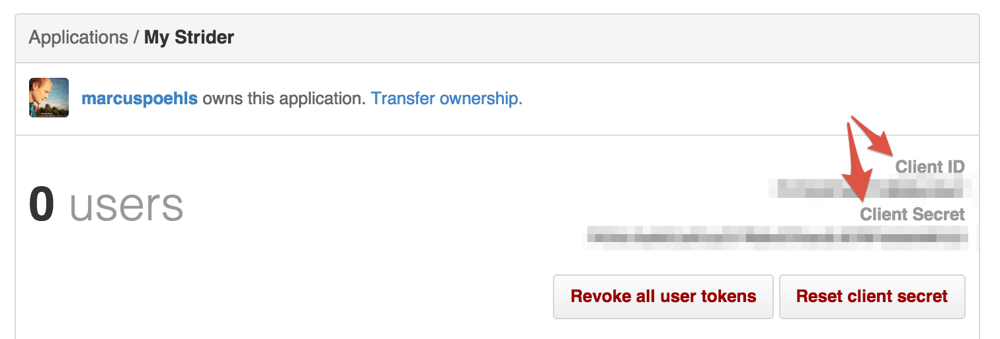
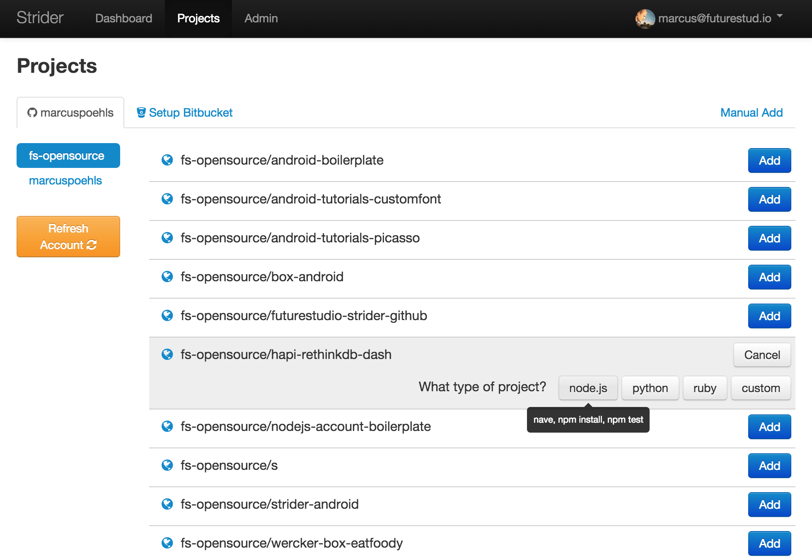
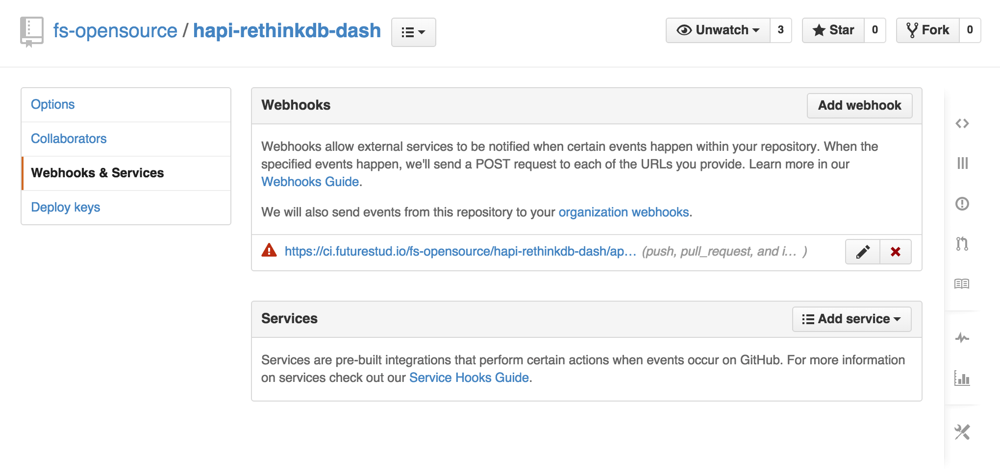
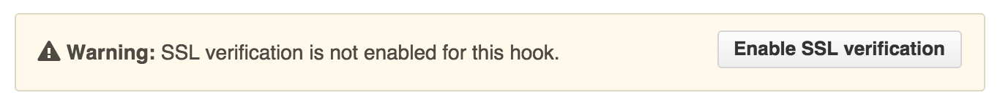

# How to Connect with GitHub and Run Tests Automatically

This week we’ going to connect Strider with GitHub and let GitHub send push notifications to run tests automatically.

## Introduction
Connecting Strider with GitHub requires various steps and configurations for your Strider server. First, we need to install the GitHub plugin for Strider (if not already done). Afterwards, we add a GitHub application, configure the Strider server and connect both services.

## Install Strider-GitHub Plugin
The first thing to do is the installation of Strider’s GitHub plugin. Head over to the plugin section in admin panel and click the `Install` button if the plugin isn’t already installed.

## Register GitHub Application
Access to your repositories from third-party applications are restricted by GitHub. To connect Strider with GitHub you need to [create a new GitHub application](https://github.com/settings/applications/new).

Fill the fields for your application. The `Authorization callback URL` is composed of your homepage url and `/auth/github/callback`.

Of course you can use a local Strider deployment running on `localhost` and provide an authorization callback URL like `http://localhost:3000/auth/github/callback` for your GitHub app.

After successful app creation, you’re redirected to the application overview. You can update your GitHub app settings and more important, the **Client ID** and **Client Secret** are depicted in the top right corner. We need both values to configure your Strider server to access GitHub correctly.

That’s the GitHub configuration part. Now we go back to Strider and configure the server.

## Configure Strider Server
The previous post illustrates the options to configure Strider and how to pass your option values to the Strider deployment.

Ok, the bad news first: the [strider-github](https://github.com/Strider-CD/strider-github) plugin doesn’t recognize configuration values passed through the `.striderrc` file. You have to pass config values via environment variables.

The GitHub plugin for Strider requires at least 3 configuration options defined: `SERVER_NAME`, `PLUGIN_GITHUB_APP_ID` and `PLUGIN_GITHUB_APP_SECRET `.

Stop your Strider server if currently running. Define the environment variables either system-wide via `export KEY=VALUE´ or just pass the variable values to the process.

	# export the values and start Strider afterwards
	export SERVER_NAME="https://your.strider.url"
	export PLUGIN_GITHUB_APP_ID="yourclientid"
	export PLUGIN_GITHUB_APP_SECRET="yourclientsecret"
	export NODE_ENV=production

	# start strider
	npm start

Start your Strider server again. It will automatically configure with provided values.

Server configuration is done. Now, we’re going to connect Strider with GitHub.

## Connect Strider With GitHub
Your Strider Dashboard will just show the hint to connect with GitLab, GitHub or add a project manually.

Clicking the **GitHub** button navigates to `github.com` and depicts the access overview. You need to authorize the application to access your public and private repositories. Additionally, Strider will access all repositories of companies you’re a member.

Granting access for your Strider app will redirect you to the provided `Authorization callback URL` in your GitHub application. Strider will navigate to the projects overview and shows your GitHub projects. You’re able to add them to Strider and run provided tests in your project.

## Add GitHub Repositories to Strider
Now that Strider is connected to your GitHub account, you can add any of your project. Click the **Add** button to show a selection of project types.

Choose the type that fits your selected project. Afterwards, you’re allowed to run the first test directly or head over to the project settings.

## Run Tests Automatically
Strider automatically creates a Webhook for the added project. With every push to the git repository, GitHub will send a `POST` request to your Strider server and trigger an automated build.

You notice the warning triangle. This triangle indicates an error delivering the hook correctly to provided webhook url. This is mostly an SSL certificate verification error. You can disable SSL verification for a Webhook to deliver the `POST` request even your certificate is not accepted by GitHub.

Just click the **Disable SSL verification** button and confirm the upcoming warning message.

## Conclusion
Strider integrates seamlessly with GitHub and provides APIs to get notified for repository changes to run code tests automatically.
